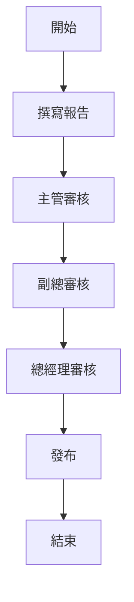

# 输出格式模板

## 業務改善報告標準格式

```markdown
# [業務主題] 改善報告

---

## 一、改善背景

**現況描述**：[簡要描述目前業務情況與問題]

**改善目標**：[期望達成的改善目標]

**範圍**：[涉及的業務範圍/人員]

**時間範圍**：[開始時間] ~ [結束時間]

---

## 二、STEP 1: 反思結果

### 2.1 KPT 分析

| 分類 | 項目 | 說明 | 行動 |
|------|------|------|------|
| Keep | ... | ... | ... |
| Keep | ... | ... | ... |
| Problem | ... | ... | ... |
| Problem | ... | ... | ... |
| Try | ... | ... | ... |
| Try | ... | ... | ... |

### 2.2 YWT 反饋

| 對象 | Y（讚） | W（感） | T（想） |
|------|---------|---------|---------|
| 張三 | ... | ... | ... |
| 李四 | ... | ... | ... |
| 王五 | ... | ... | ... |

**整體收斂**：
- [重點讚賞事項]
- [重點感謝事項]
- [通用改進方向]

### 2.3 PDCA 檢核結果

| 階段 | 檢核項 | 結果 | 依據 |
|------|--------|------|------|
| P | 目標是否明確確？ | ☑ / ☐ | ... |
| P | 計畫是否完整？ | ☑ / ☐ | ... |
| D | 執行是否按計畫？ | ☑ / ☐ | ... |
| D | 進度是否符合預期？ | ☑ / ☐ | ... |
| C | 數據是否收集？ | ☑ / ☐ | ... |
| C | 原因是否分析？ | ☑ / ☐ | ... |
| A | 成功是否標準化？ | ☑ / ☐ | ... |
| A | 課題是否設定？ | ☑ / ☐ | ... |

**檢核結論**：
- [達成的項目]
- [需要改善的項目]
- [下一步行動]

---

## 三、STEP 2: 業務狀態視覺化

### 3.1 業務盤點表

| 業務項目 | 頻率 | 負責人 | 時間 | 重要度 | 問題點 | 優先順序 |
|---------|------|--------|------|--------|--------|----------|
| 週報 | 每週 | 張三 | 60分 | 高 | 自動化不足 | 1 |
| 月報 | 每月 | 李四 | 120分 | 高 | 流程複雜 | 2 |
| |

**盤點分析**：
```
高頻率、高耗時（優先改善）：
- 週報（每週，60分鐘）
- 會議整理（每週，40分鐘）

中頻率、高耗時（次優先）：
- 月報（每月，120分鐘）
- 年報（每年，480分鐘）

價值分析：
- 重要但做得不好：週報、月報
- 不重要但耗時：[若存在]
```

### 3.2 業務流程圖

**改善前流程**：



**瓶頸識別**：
- [ ] 多餘步驟：...
- [ ] 等待時間點：...
- [ ] 資訊不連接：...

### 3.3 PERT 分析

**任務依賴與時間估算**：

| 任務 | 時間 | 先置任務 |
|------|------|----------|
| A | 3天 | - |
| B | 4天 | - |
| C | 2天 | A |
| D | 5天 | A, B |
| E | 3天 | B |

**路徑分析**：
- 路徑1 (A→C): 3 + 2 = 5天
- 路徑2 (A→D): 3 + 5 = 8天
- 路徑3 (B→D): 4 + 5 = 9天  ← 關鍵路徑
- 路徑4 (B→E): 4 + 3 = 7天

**最短總時間**: 9天
**關鍵任務**: B → D

### 3.4 RACI 矩陣

| 任務 | 張三 | 李四 | 王五 | 陳六 |
|------|------|------|------|------|
| 撰寫報告 | R | I | I | I |
| 主管審核 | I | A | C | I |
| 副總審核 | I | I | A | C |
| 總經理審核 | I | I | I | A |

**責任分析**：
- [ ] 每個任務有唯一負責人
- [ ] 角色分配合理
- [ ] 無權責模糊

---

## 四、STEP 3: 改善策略

### 4.1 勉強．不均．浪費分析

#### Muri（勉強）分析

| 現象 | 影響 | 改善方案 |
|------|------|---------|
| 超時工作 | 員工疲勞 | 調整負荷 |
| | | |

#### Mura（不均）分析

| 現象 | 影響 | 改善方案 |
|------|------|---------|
| 忽忙忽閒 | 效率低 | 平準化工作流 |
| | | |

#### Muda（浪費）分析

| 類型 | 現象 | 改善方案 |
|------|------|---------|
| 等待 | 審核等待時間長 | 串並行審核 |
| 不必要輸送 | 檔反覆上傳下載 | 線上系統 |
| | | |

### 4.2 ECRS 改善策略

| 原流程 | ECRS方向 | 改善後流程 | 效果 |
|--------|---------|-----------|------|
| 撰寫 → 主管審核 → 副總審核 → 總經理審核 | E（削除） | 撰寫 → 主管與副總同步審核 → 總經理審核 | 節省0.5天 |
| | C（結合） | 主管與副總同步審核 | 節省0.5天 |
| | R（重排） | 總經理於審核後直接發布 | 節省0.5天 |
| | S（簡化） | 改用線上系統 | 節省1天 |

**總改善效果**：共節省2.5天

### 4.3 業務改善提案表

#### 提案 1: [提案名稱]

| 欄位 | 內容 |
|------|------|
| 標題 | [提案標題] |
| 現況描述 | [目前的問題與影響] |
| 改善方案 | [具體改善措施] |
| 改善效果 | [預期好處，可量化] |
| 實施成本 | [預估成本與資源] |
| 實施時程 | [計畫執行時間] |
| 實施風險 | [可能遇到的困難] |
| 關鍵成功因素 | [確保成功的要點] |

#### 提案評分

| 提案 | 改善幅度(30%) | 可行性(25%) | 成本收益(25%) | 風險控制(20%) | 總分 | 排名 |
|------|--------------|------------|-------------|--------------|------|------|
| 提案1 | 8/10 | 7/10 | 9/10 | 8/10 | 8.0 | 1 |
| 提案2 | 6/10 | 9/10 | 7/10 | 8/10 | 7.4 | 2 |

---

## 五、會議規劃

### 5.1 會議前準備

**檢核清單**：
- [ ] 明確會議目標
- [ ] 準備相關資料
- [ ] 發送議程邀請
- [ ] 確認參與者
- [ ] 預約場地設備

**會議議程**：
```markdown
## [會議名稱] 議程

**目標**：[會議目標]

**時間**：[日期時間] (90分鐘)

**議程**：
1. 開場 (10分鐘)
2. KPT分享 (20分鐘)
3. 業務盤點分析 (20分鐘)
4. 分組討論 (25分鐘)
5. 總結與行動項目 (10分鐘)
6. 下次會議安排 (5分鐘)
```

### 5.2 會議記錄

**參與者**：[姓名清單]

**討論重點**：
1. [重點一]
2. [重點二]
3. [重點三]

**決議事項**：
1. [決議一]
2. [決議二]

**行動清單**：

| 行動 | 負責人 | 截止日期 | 狀態 |
|------|--------|----------|------|
| [行動一] | [姓名] | [日期] | ━ |
| [行動二] | [姓名] | [日期] | ━ |

---

## 六、執行計畫

### 6.1 時程安排

| 階段 | 工作項目 | 開始 | 結束 | 天數 | 負責人 |
|------|---------|------|------|------|--------|
| 準備 | 收集數據 | ... | ... | 3天 | 張三 |
| 設計 | 設計改善方案 | ... | ... | 5天 | 李四 |
| 實施 | 推行改善 | ... | ... | 15天 | 全體 |
| 評估 | 效果評量 | ... | ... | 7天 | 王五 |

### 6.2 資源需求

| 資源類型 | 需求 | 可用 | 缺口 | 行動 |
|---------|------|------|------|------|
| 人力 | [人数] | [人数] | [人数] | [行動] |
| 預算 | [金額] | [金額] | [金額] | [行動] |
| 設備 | [設備] | [設備] | [設備] | [行動] |

---

## 七、預期成果

### 7.1 量化目標

| 指標 | 目前值 | 目標值 | 改善幅度 |
|------|--------|--------|---------|
| 處理時間 | 60分 | 10分 | -83% |
| 錯誤率 | 15% | 3% | -80% |
| 滿意度 | 65% | 85% | +31% |

### 7.2 質化成果

- [ ] 流程簡化，步驟減少
- [ ] 工作負荷均勻分配
- [ ] 員工滿意度提升
- [ ] 品質穩定提升

---

## 八、下一步行動

| 優先順序 | 行動項目 | 負責人 | 截止日期 |
|---------|---------|--------|----------|
| 1 | [最重要的事] | [姓名] | [日期] |
| 2 | [次重要的事] | [姓名] | [日期] |
| 3 | [第三重要的事] | [姓名] | [日期] |

---

## 九、風險管理

| 風險 | 機率 | 影響 | 應對策略 |
|------|------|------|---------|
| [風險一] | 高 | 高 | [應對] |
| [風險二] | 中 | 中 | [應對] |

---

**報告完成時間**: YYYY-MM-DD HH:MM
**報告版本**: v1.0
**下次複盤日期**: YYYY-MM-DD
```

---

## 簡化報告模板

```markdown
# [業務主題] 快速改善報告

## 背景與問題
- 目前的問題：[1-2句]
- 改善目標：[1句]

## 反思結果（KPT）
- K: [做得好的地方]
- P: [需要改善的問題]
- T: [想要嘗試的新方法]

## 業務狀態
- 問題業務：[列出優先改善的業務]
- 瓶頸點：[流程中的關鍵問題點]

## 改善策略
- ECRS: [具體改善措施]
- 重點方案: [選定的改善提案]

## 行動計畫
1. [第一步]
2. [第二步]

## 預期效果
- 時間節省：[X%]
- 效率提升：[X%]

---
```
