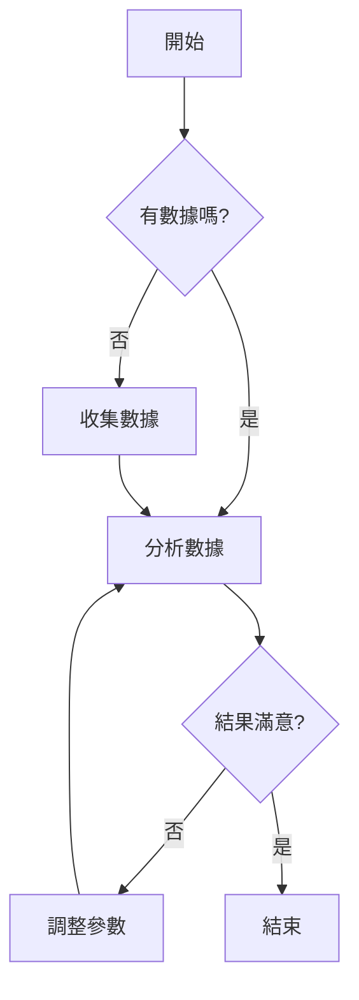

# 方法论详解

## STEP 1: 创意激发方法

### 1. 腦力書寫 (Brainstorming)

#### 起源
由 Alex Osborn 于 1953 年在《Applied Imagination》中提出。

#### 四项基本规则
1. **延迟判断**：不批评任何想法
2. **数量先于质量**：想法越多越好
3. **欢迎疯狂想法**：突破惯常思维
4. **搭顺风车**：在他人的想法上延伸

#### 执行要点
- 设定时间限制（10-15分钟）
- 每人轮流发言，允许跳过
- 使用便签纸或白板记录
- 鼓励视觉化表达

---

### 2. 曼陀羅九宮格 (Mandala Chart)

#### 起源
源自曼陀羅圖形，后由日本發展為系統化思考工具。

#### 核心原理
從中心主题出發，向八個方向拓展，形成系統化思考網絡。

#### 八個拓展方向

| 方向 | 思考維度 | 舉例 |
|------|----------|------|
| 放大 | 規模、範圍強化 | 手機 → 穿戴設備 |
| 類比 | 其他領域參考 | 電商 → 社群電商 |
| 逆向 | 反向思考 | 賣產品 → 賣訂閱 |
| 結合 | 元素融合 | 健康 + 遊戲 |
| 替代 | 技術/材料替換 | 實體 → 數位 |
| 縮小 | 簡化、聚焦 | 全功能 → MVP |
| 環境 | 情境變化 | 家用 → 外帶 |
| 時間 | 時間因素調整 |一次性 → 訂閱 |

#### 使用場景
- 產品創新設計
- 行銷策略拓展
- 問題解決方案發散

---

### 3. 型態分析法 (Morphological Analysis)

#### 起源
由瑞士天文學家 Fritz Zwicky 於 1940 年代提出。

#### 核心原理
將問題分解為多個獨立維度，每個維度列出可能選項，透過系統組合產生創意。

#### 執行步驟
1. **定義維度**：識別問題的關鍵變數
2. **列出選項**：為每個維度列舉可能的選擇
3. **組合創意**：從不同維度選擇不同選項組合

#### 範例：新產品開發

| 維度 | 選項1 | 選項2 | 選項3 | 選項4 |
|------|-------|-------|-------|-------|
| 目標市場 | 年輕人 | 商務人士 | 家庭主婦 | 銀髮族 |
| 產品形式 | App | 網頁 | 硬體 | 混合 |
| 收費模式 | 免費 | 訂閱 | 一次性 | 增值 |
| 傳播管道 | 社群 | 廣告 | 口碑 | KOL |
| 分銷渠道 | 直銷 | 平台 | 經銷 | O2O |

組合範例：年輕人 + App + 免費 + 社群 + 平台

#### 優點
- 系統化，不易遺漏
- 可發現非直觀的組合
- 適合進行定量分析

---

### 4. 腳本圖 (Scenario Scripting)

#### 起源
源自軍事戰略規劃，後應用於企業策略。

#### 核心原理
描繪不同未來情境下的發展路徑，幫助識別關鍵決策點和風險。

#### 三種情境類型

**最佳情況**
- 假設一切順利
- 外部環境有利
- 資源超出預期

**最差情況**
- 遭遇最大阻力
- 資源嚴重不足
- 外部環境惡化

**最可能情況**
- 基於現實判斷
- 考慮各項限制
- 需要折衝取捨

#### 執行步驟
1. 定義情境的關鍵不確定因素
2. 描述每種情境的發展軌跡
3. 識別關鍵決策點
4. 制定應對策略

#### 使用場景
- 新事業發展規劃
- 危機管理預案
- 策略選擇評估

---

### 5. 奧斯本檢核表 (Osborn's Checklist)

#### 起源
由 Alex Osborn 提出，系統化擴展思路的七個方向。

#### 七個檢核方向

| 方向 | 中文 | 思考問題 |
|------|------|----------|
| Modify | 修改 | 能否改變形狀、顏色、聲音氣味？ |
| Magnify | 放大 | 能否增加、延長、加強？ |
| Minify | 縮小 | 能否縮減、省略、濃縮？ |
| Substitute | 替代 | 能否用其他材料、技術、方法？ |
| Rearrange | 重組 | 能否調整順序、結構、佈局？ |
| Reverse | 反轉 | 能否顛倒順序、方向、角色？ |
| Combine | 結合 | 能否與其他事物、概念、功能結合？ |

#### 應用範例：改善一個咖啡館

| 方向 | 創意 |
|------|------|
| Modify | 將木質桌椅改為可調整高度的辦公家具 |
| Magnify | 擴大空間，增加閱讀區和會議室 |
| Minify | 推出迷你外帶杯和輕食 |
| Substitute | 用自選豆取代固定豆種 |
| Rearrange | 將吧台移到中心，增加互動性 |
| Reverse | 從「賣咖啡」轉為「賣空間」 |
| Combine | 咖啡 + 書店 + 銀髮社交 |

#### 優點
- 結構化，易於執行
- 適合個人或團隊
- 可重複使用

---

## STEP 2: 创意具象化方法

### 创意表单 (Idea Form)

#### 目的
將抽象創意轉化為可執行的具體方案。

#### 關鍵欄位設計

| 欄位 | 目的 | 範例 |
|------|------|------|
| 創意名稱 | 快速識別 | 「智慧通勤助手」 |
| 核心概念 | 一語道破 | 用 AI 規劃最佳通勤路線 |
| 目標用戶 | 明確受益對象 | 台北上班族 |
| 核心功能 | 3-5個關鍵功能 | 路線推薦、實時提醒、交通資訊 |
| 獨特優勢 | 差異化定位 | 整合多種交通方式 |
| 資源需求 | 人力/時間/預算 | 需要後端工程師、地圖 API |
| 風險點 | 預見困難 | 資料來源整合難度 |
| 成功指標 | 可衡量結果 | DAU、路線使用率 |

---

### 分鏡圖 / 流程圖

#### 目的
可視化實作流程，識別關鍵節點和決策點。

#### 結構要素

1. **開始/結束點**：圓角矩形
2. **流程步驟**：矩形
3. **決策點**：菱形
4. **資源需求**：括號或註記

#### Mermaid 語法範例

---

## STEP 3: 创意评比方法

### 優缺點列表

#### 目的
平衡評估創意的正反面，避免片面判斷。

#### 評估原則

1. **對稱性**：優缺點數量應大致相等
2. **具體化**：避免模糊描述
3. **量化**：盡量使用數據

#### 常見成見與對策

| 成見 | 對策 |
|------|------|
| 只看優點 | 強制每個創意至少3個缺點 |
| 只看缺點 | 強制每個創意至少3個優點 |
| 模糊描述 | 要求使用具體數據或例子 |

---

### SUCCESs 評估法

#### 起源
由 Chip Heath & Dan Heath 在《Made to Stick》中提出。

#### 七個維度詳細說明

| 維度 | 中文 | 評估要點 |
|------|------|----------|
| Simple | 簡單 | 核心資訊是否一語道破？是否容易被複製傳播？ |
| Unexpected | 意外 | 能否打破常規、引起驚奇？有沒有令人驚訝的元素？ |
| Concrete | 具體 | 描述是否具體可理解？是否使用感官語言？ |
| Credible | 可信 | 有數據、專家或實例背書？來源是否可靠？ |
| Emotional | 情感 | 能觸動情感、建立連結？是否與目標受眾產生共鳴？ |
| Story | 故事 | 能用故事讓人記住？是否有引人入勝的敘事？ |
| Short | 簡短 | 能用140字內說清楚？是否適合社交媒體傳播？ |

#### 評分標準

| 分數 | 說明 |
|------|------|
| 1分 | 完全不符合 |
| 2分 | 略微符合但明顯不足 |
| 3分 | 基本符合 |
| 4分 | 很好符合 |
| 5分 | 完全符合，超出預期 |

#### 解讀建議
- 總分 < 21：需要大幅改進
- 總分 21-28：有潛力，局部優化
- 總分 > 28：強勢創意

---

### 報酬矩陣 (Reward Matrix)

#### 起源
源自投資理論中的風險-報酬分析。

#### 核心原理
將創意依據「報酬大小」和「成功機率」分類，決定投入策略。

#### 四個象限

| | 低機率 | 高機率 |
|----|--------|--------|
| **高報酬** | 賭注型 🔥 | 明星型 ⭐ |
| **低報酬** | 放棄 ❌ | 穩定型 ✓ |

#### 各象限策略

**明星型（高機率 × 高報酬）**
- 定義：最有價值的創意
- 策略：優先執行，重點投入
- 舉例：利用現有資源擴展新市場

**賭注型（低機率 × 高報酬）**
- 定義：高風險高報酬
- 策略：可嘗試，但控制投入，設定止损點
- 舉例：全新技術平台開發

**穩定型（高機率 × 低報酬）**
- 定義：安全但創新有限
- 策略：可作為後備或輔助方案
- 舉例：現有產品小改進

**放棄（低機率 × 低報酬）**
- 定義：無價值的創意
- 策略：不投入資源
- 舉例：市場已飽和的模仿型產品

#### 機率和報酬評估標準

**機率評估**

| 等級 | 描述 | 機率範圍 |
|------|------|----------|
| 高 | 成功可能性很大 | > 70% |
| 中 | 成敗各半 | 30-70% |
| 低 | 成功困難 | < 30% |

**報酬評估**

| 等級 | 描述 |
|------|------|
| 高 | 顯著改善基本問題，創造大價值 |
| 中 | 有改善但影響有限 |
| 低 | 影響微不足道 |

#### 數學模型（可選）

期望值 = 機率 × 報酬值

範例：
- 方案A：機率 80% × 報酬 10 = 8.0
- 方案B：機率 20% × 報酬 100 = 20.0

註：報酬矩陣主要用於定性分析，數學模型可作為補充參考。
