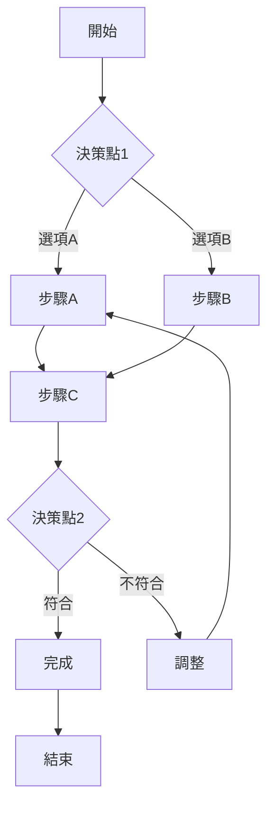

# 输出格式模板

## 报告结构

完整的创意构思与评选报告应包含以下部分：

```markdown
# [课题名称] 创意构思与评选报告

---

## 一、课题背景

**问题描述**：[简要描述要解决的课题]

**目标**：[明确期望达到的目标]

**时间**：YYYY-MM-DD

**参与人员**：[列出参与人员，如有]

---

## 二、STEP 1: 创意激发

### 2.1 腦力書寫結果

共生成 [XX] 个初步创意：

| 编号 | 创意描述 | 方法 |
|------|----------|------|
| 1 | ... | 腦力書寫 |
| 2 | ... | 曼陀羅 |
| 3 | ... | 型態分析 |
| ... | ... | ... |

### 2.2 創意來源分析

**曼陀羅九宮格拓展**：

| 放大 | 類比 | 逆向 |
|------|------|------|
| 替代 | 核心主題 | 結合 |
| 縮小 | 環境 | 時間 |

[详细說明每个格子的創意]

**型態分析矩陣**：

| 維度 | 選項A | 選項B | 選項C | 選項D |
|------|-------|-------|-------|-------|
| 維度1 | [創意] | ... | ... | ... |
| 維度2 | ... | ... | ... | ... |

**腳本圖推演**：

| 情況 | 描述 | 關鍵決策點 |
|------|------|------------|
| 最佳 | ... | ... |
| 最差 | ... | ... |
| 最可能 | ... | ... |

**奧斯本檢核表**：

| 方向 | 創意 |
|------|------|
| Modify | ... |
| Magnify | ... |
| Minify | ... |
| Substitute | ... |
| Rearrange | ... |
| Reverse | ... |
| Combine | ... |

### 2.3 創意整合與篩選

經整理，保留 [XX] 個有潛力的創意：

[列出保留的創意清單]

---

## 三、STEP 2: 创意具象化

### 3.1 創意表單詳細規格

#### 創意 1: [創意名稱]

**核心概念**：[一句话描述核心价值]

**目标用戶**：[明确受益对象]

**核心功能**：
- 功能1：[描述]
- 功能2：[描述]
- 功能3：[描述]

**獨特優勢**：
- [與現有方案的差異]
- [競爭對手沒有的特點]

**資源需求**：
- 人力：[所需技能、人数]
- 時間：[開發週期]
- 預算：[金額估算]
- 技術：[所需技術棧]

**風險點**：
- 風險1：[描述] → 應對：[解決方案]
- 風險2：[描述] → 應對：[解決方案]

**成功指標**：
- [KPI1]: 目标值
- [KPI2]: 目标值
- [KPI3]: 目标值

---

#### 創意 2: [創意名稱]

[同上结构]

---

### 3.2 實作流程圖



---

## 四、STEP 3: 创意评比与选择

### 4.1 優缺點評比

#### [創意1]

**優點**：
- ...
- ...
- ...

**缺點**：
- ...
- ...
- ...

#### [創意2]

[同上结构]

---

### 4.2 SUCCESs 評估

#### [創意名稱]

| 维度 | 評分 (1-5) | 說明 |
|------|-----------|------|
| Simple       | [X]/5 | ... |
| Unexpected   | [X]/5 | ... |
| Concrete     | [X]/5 | ... |
| Credible     | [X]/5 | ... |
| Emotional    | [X]/5 | ... |
| Story        | [X]/5 | ... |
| Short        | [X]/5 | ... |
| **總分**     | **[XX]/35** | |

#### [創意名稱 2]

[同上结构]

---

### 4.3 報酬矩陣評估

| 創意 | 報酬 | 機率 | 類型 | 建議 |
|------|------|------|------|------|
| [創意1] | 高 | 高 | 明星型 | 優先執行 |
| [創意2] | 高 | 低 | 賭注型 | 控制投入 |
| [創意3] | 低 | 高 | 穩定型 | 後備方案 |
| [創意4] | 低 | 低 | 放棄 | 不投入 |

---

## 五、避免成見檢查

| 检查項目 | 狀態 | 說明 |
|----------|------|------|
| 是否至少生成了10个以上的创意？ | ✅/❌ | ... |
| 是否有匿名评比或多角度评估？ | ✅/❌ | ... |
| 是否使用了数据和证据，而非直觉？ | ✅/❌ | ... |
| 是否忽略了最初的几个想法？ | ✅/❌ | ... |
| 是否为反对意見提供了平等的权重？ | ✅/❌ | ... |
| 是否邀请了不同背景的人员参与？ | ✅/❌ | ... |
| 生成的创意是否来自多种方法？ | ✅/❌ | ... |

---

## 六、最终选择

### 選定方案：[創意名稱]

**選擇理由**：
- SUCCESs 評分：[XX]/35（排名第[X]）
- 報酬矩陣類型：[明星型/穩定型/賭注型]
- 優缺點分析：优势明显，风险可控
- 資源匹配度：與現有能力/預算相符

**執行優先级**：
1. [短期目标] - 时间：[XX天]
2. [中期目标] - 时间：[XX]
3. [长期目标] - 时间：[XX]

**後備方案**：[創意名稱]

**放棄方案**：
- [創意名稱1]: [原因]
- [創意名稱2]: [原因]

---

## 七、行动计划

| 階段 | 時間 | 行動項 | 責任人 | 完成指標 |
|------|------|--------|--------|----------|
| 第一階段 | [時間] | ... | ... | ... |
| 第二階段 | [時間] | ... | ... | ... |
| 第三階段 | [時間] | ... | ... | ... |

---

## 八、附件

- [附件1: 腦力書寫原始記錄]
- [附件2: 曼陀羅九宮格完整圖]
- [附件3: 參與者反饋意見]

---

**報告生成時間**: YYYY-MM-DD HH:MM
**報告版本**: v1.0
```

---

## 简化报告模板（适用于快速迭代）

```markdown
# [课题] 快速构思报告

## 问题
[一句话描述]

## 创意清单（共 X 个）

| # | 创意 | 来源 |
|---|------|------|
| 1 | ... | 腦力書寫 |
| 2 | ... | 曼陀羅拓展 |
| 3 | ... | ... |

## 重点创意具象化

### 创意: [名称]
- 概念: ...
- 功能: ...
- 风险: ...

## 评比结果

| 创意 | SUCCESs | 報酬矩陣 | 綜合排名 |
|------|---------|----------|----------|
| ... | XX/35 | 明星型 | 1 |
| ... | XX/35 | 穩定型 | 2 |

## 决策
**選擇**: [创意名稱]
**理由**: ...

---
```
