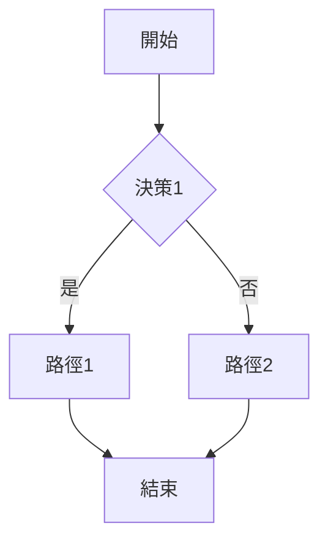

# 思索課題解決方法

## 任务目标
運用三步驟方法论幫助使用者系統化生成與評選創意解決方案，避免成見干擾，確保決策的客觀性與創新性。

## 触发方式

### 主动触发
当用户提出以下类型的需求时触发：
- "想一些解决方案"
- "有什么好的点子"
- "需要创新想法"
- "评估这些方案"
- 面临需要构思和选擇的场景

### 命令触发
```bash
/ideate [问题描述]
```

## 核心原则：谨防成見

在激發或評比創意時必須留意以下成見陷阱：

### 常见成見类型

| 成見 | 说明 | 防範策略 |
|------|------|---------|
| 沉沒成本 | 過度投資已投入的資源 | 每個創意獨立評估，忽略過往投入 |
| 錨定效應 | 被第一個想法固化 | 強制生成至少10個創意後再開始評比 |
| 確認偏誤 | 只尋找支持自己觀點的證據 | 要求為每個創意列出優缺點的等量權重 |
| 權威偏誤 | 盲從專家意見 | 邀請多種背景的人員參與評比 |
| 近效應 | 偏好最近接觸的想法 | 將創意打亂順序後匿名評比 |
| 可得性偏誤 | 高估容易想到的例子 | 使用數據和證據，而非直覺 |

## 操作步骤

### STEP 1: 不设限地拋出創意

#### 1.1 腦力書寫 (Brainstorming)

**目标**: 快速生成大量創意，不設限制。

**步骤**:
1. 设定时间限制（10-15分钟）
2. 写下**所有**想法，不作筛选
3. 禁止批评（包括自我批评）
4. 鼓励疯狂想法
5. 基于他人想法延伸（搭顺风车）

**输出格式**:
```markdown
## 腦力書寫結果
[列出所有生成的創意，暂不評估]
```

#### 1.2 曼陀羅九宮格 (Mandala Chart)

**目标**: 從八個維度拓展核心想法。

**樣式**:
```
        [2]環境        [3]時間        [4]逆向
        ---------------------------------
[8]替代|      [1]核心主題     | [5]結合
        ---------------------------------
        [7]縮小        [6]放大        [9]類比
```

**應用說明**:
- [6] 放大：規模、範圍強化
- [9] 類比：參考其他領域類似解法
- [2] 環境：情境/空間變化
- [3] 時間：速成/延後/週期性
- [4] 逆向：反向思考
- [5] 結合：與其他元素融合
- [7] 縮小：簡化/聚焦
- [8] 替代：使用不同材料/技術

**輸出格式**:
```markdown
## 曼陀羅九宮格分析
| 放大 | 類比 | 逆向 |
|------|------|------|
| 替代 | 核心 | 結合 |
| 縮小 | 環境 | 時間 |

[每個格子的創意說明]
```

#### 1.3 型態分析法 (Morphological Analysis)

**目标**: 系統化組合不同維度的變體。

**步驟**:
1. 識別問題的關鍵維度（如：產品特性、目標客戶、傳播管道）
2. 為每個維度列出可能的選項
3. 從不同維度各選一個選項組合

**範例**:
| 維度 | 選項1 | 選項2 | 選項3 |
|------|-------|-------|-------|
| 價格 | 免费 | 訂閲制 | 一次性購買 |
| 平台 | 行動裝置 | 桌機 | 全平台 |
| 功能 | 基礎 | 進階 | 專業 |

**輸出格式**:
```markdown
## 型態分析矩陣
[維度 × 選項表格]
[列出有潛力的組合解決方案]
```

#### 1.4 腳本圖 (Scenario Scripting)

**目标**: 描繪不同情況下的實作路徑。

**三種情況**:

**最佳情況**
- 一切順利
- 資源充足
- 外部條件有利

**最差情況**
- 遇到阻礙
- 資源不足
- 外部壓力

**最可能情況**
- 現實條件
- 中間風險
- 需要折衝

**輸出格式**:
```markdown
## 腳本圖分析
### 最佳情況
[描述及關鍵鍵決策點]

### 最差情況
[描述及應對策略]

### 最可能情況
[描述及風險管理]
```

#### 1.5 奧斯本檢核表 (Osborn's Checklist)

**目标**: 七個方向系統化擴展思路。

**七個檢核問題**:

| 檢核方向 | 提問 | 範例 |
|---------|------|------|
| 修改 | 能否改變形狀顏色？ | 把圓形改為方形 |
| 放大 | 能否擴大規模？ | 增加功能、延長時間 |
| 縮小 | 能否精簡縮減？ | 移除非必要功能 |
| 替代 | 能否用其他材料/技術？ | AI 取代人工 |
| 重組 | 能否調整順序/結構？ | 重新排列流程 |
| 反轉 | 能否顛倒順序/方向？ | 先做後再做 |
| 結合 | 能否與其他事物結合？ | 社群 + 電商 |

**輸出格式**:
```markdown
## 奧斯本檢核表結果
[每個檢核方向的創意清單]
```

### STEP 2: 將創意具體化

#### 2.1 創意表單 (Idea Form)

**目标**: 將抽象創意轉化為具體方案。

**表單結構**:

| 欄位 | 說明 |
|------|------|
| 創意名稱 | 簡明扼要的名稱 |
| 核心概念 | 一句話描述核心價值 |
| 目標用戶 | 誰會使用/受益 |
| 核心功能 | 3-5個關鍵功能 |
| 獨特優勢 | 與現有方案的差異 |
| 資源需求 | 人力、時間、預算 |
| 風險點 | 可能遇到的困難 |
| 成功指標 | 如何衡量效果 |

**輸出格式**:
```markdown
## 創意具體化表單
### [創意名稱]
**核心概念**: ...
**目標用戶**: ...
**核心功能**:
- ...
- ...
**獨特優勢**: ...
**資源需求**: ...
**風險點**: ...
**成功指標**: ...
```

#### 2.2 分鏡圖 / 流程圖 (Storyboard/Flow)

**目标**: 可視化實作流程。

**步驟**:
1. 關鍵節點識別
2. 節點之間的連結
3. 標注決策點
4. 註明所需資源

**輸出格式**:
```markdown
## 實作流程圖
[使用 ASCII 或 Mermaid 圖]

```

### STEP 3: 評比並選擇創意

#### 3.1 優缺點列表 (Pros & Cons)

**目标**: 平衡評估每個創意的正反面。

**評估原則**:
- 每個創意至少列出3個優點、3個缺點
- 避免使用模糊描述（如「不錯」、「可以」）
- 根據影響程度和發生機率評估

**輸出格式**:
```markdown
## 優缺點評比
### [創意1]
**優點**:
- ...
- ...
**缺點**:
- ...
- ...

### [創意2]
[同上結構]
```

#### 3.2 SUCCESs 評估法

**目标**: 依據七個維度評估創意成功潛力。

**七個維度**: 由 Chip Heath & Dan Heath 提出

| 維度 | 英文 | 評估問題 |
|------|------|---------|
| S | Simple (簡單) | 核心資訊能一語道破嗎？ |
| U | Unexpected (意外) | 能打破常規、引起驚奇嗎？ |
| C | Concrete (具體) | 描述是否具體可理解？ |
| C | Credible (可信) | 有數據、專家或實例背書嗎？ |
| E | Emotional (情感) | 能觸動情感、建立連結嗎？ |
| S | Story (故事) | 能用故事讓人記住？ |
| s | Short (簡短) | 能用140字內說清楚？ |

**評分方式**: 每個維度 1-5 分，總分 7-35 分

**輸出格式**:
```markdown
## SUCCESs 評估
### [創意名稱]
| 維度 | 評分 | 說明 |
|------|------|------|
| Simple | X/5 | ... |
| Unexpected | X/5 | ... |
| Concrete | X/5 | ... |
| Credible | X/5 | ... |
| Emotional | X/5 | ... |
| Story | X/5 | ... |
| Short | X/5 | ... |
| **總分** | **XX/35** | |

[其他創意同格式]
```

#### 3.3 報酬矩陣 (Reward Matrix)

**目标**: 評估創意的風險與報酬關係。

**矩陣結構**:

|  | 低機率 | 高機率 |
|--|--------|--------|
| **高報酬** | 賭注型創意 | 明星創意 |
| **低報酬** | 放棄 | 解決當前問題 |

**分類說明**:

| 類型 | 特點 | 建議 |
|------|------|------|
| 明星創意 | 高機率、高報酬 | **優先執行** |
| 賭注型創意 | 低機率、高報酬 | 可嘗試，控制投入 |
| 解決當前問題 | 高機率、低報酬 | 可作為後備 |
| 放棄 | 低機率、低報酬 | 不投入資源 |

**輸出格式**:
```markdown
## 報酬矩陣評估
| 創意 | 報酬 | 機率 | 類型 | 建議 |
|------|------|------|------|------|
| [創意1] | 高 | 高 | 明星 | 優先執行 |
| [創意2] | 高 | 低 | 賭注 | 控制投入 |
| ... | ... | ... | ... | ... |
```

## 完整工作流程

```
開始
  ↓
STEP 1: 不設限拋出創意
  ├─ 腦力書寫 (初步清單)
  ├─ 曼陀羅九宮格 (八向拓展)
  ├─ 型態分析法 (系統組合)
  ├─ 腳本圖 (情況推演)
  └─ 奧斯本檢核表 (七向檢核)
  ↓
篩選整理 (去除重複、合併類似)
  ↓
STEP 2: 創意具象化
  ├─ 創意表單 (詳細規格)
  └─ 分鏡圖 (流程可視)
  ↓
STEP 3: 評比選擇
  ├─ 優缺點列表 (平衡評估)
  ├─ SUCCESs 評估 (成功潛力)
  └─ 報酬矩陣 (風險報酬)
  ↓
[避免成見檢查清單]
  ↓
選擇最佳方案
  ↓
結束
```

## 避免成見檢查清單

在選擇最終方案前，使用以下檢查清單：

- [ ] 是否至少生成了10個以上的創意？
- [ ] 是否有匿名評比或多角度評估？
- [ ] 是否使用了數據和證據，而非直覺？
- [ ] 是否忽略了最初的幾個想法（避免錨定）？
- [ ] 是否為反對意見提供了平等的權重？
- [ ] 是否邀請了不同背景的人員參與？
- [ ] 生成的創意是否來自多種方法？

## 輸出格式

完成分析後輸出結構化報告。

報告格式詳見 [references/output-format.md](references/output-format.md)
