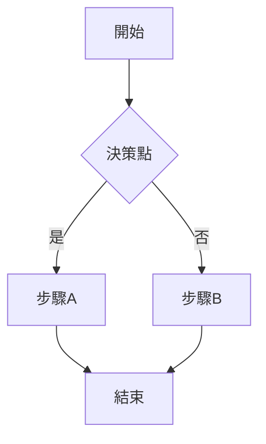

# 输出格式模板

## 策略制定报告标准格式

```markdown
# [策略主題] 發展策略報告

---

## 一、策略背景

**現況描述**：[簡要描述目前情況]

**問題陳述**：[要解決的核心問題]

**目標**：[期望達到的結果]

**時間範圍**：[開始時間] ~ [結束時間]

**涉及範圍**：[活動範圍/市場範圍]

---

## 二、STEP 1: 策略方向分析

### 2.1 產品組合矩陣

| 產品/服務 | 市場成長率 | 市場份額 | 象限 | 策略 |
|-----------|-----------|---------|------|------|
| 產品A | 高 | 高 | 明星 | 投資維持 |
| 產品B | 低 | 高 | 現金牛 | 收穫現金 |
| 產品C | 高 | 低 | 問題產品 | 評估投資 |
| 產品D | 低 | 低 | 瘦狗 | 退出或放棄 |

**資源分配建議**：
- [根據產品組合矩陣說明資源投放方向]

---

### 2.2 安索夫成長矩陣選擇

| 策略類型 | 選擇 | 說明 | 風險評估 |
|---------|------|------|---------|
| 市場滲透 | ☐ ☑ | [選擇理由] | 低 |
| 市場開發 | ☐ ☑ | [選擇理由] | 中 |
| 產品開發 | ☐ ☑ | [選擇理由] | 中 |
| 多角化 | ☐ ☑ | [選擇理由] | 高 |

**選擇策略**：[主要成長路徑]

**依據**：[選擇此策略的原因]

---

### 2.3 交叉SWOT分析

#### SWOT因素

| | 機會 (O) | 威脅 (T) |
|---|---------|---------|
| **優勢 (S)** | O1: ...<br>O2: ... | T1: ...<br>T2: ... |
| **劣勢 (W)** | O1: ...<br>O2: ... | T1: ...<br>T2: ... |

#### 策略交叉

**SO策略（優勢-機會）**
1. [策略說明]
2. [策略說明]

**WO策略（劣勢-機會）**
1. [策略說明]
2. [策略說明]

**ST策略（優勢-威脅）**
1. [策略說明]
2. [策略說明]

**WT策略（劣勢-威脅）**
1. [策略說明]
2. [策略說明]

**優先順序**：
1. [最優先策略]
2. [次優先策略]
3. ...

---

### 2.4 STP分析

**S - 市場細分**

| 細分標準 | 細分市場 | 規模 | 特徵 |
|---------|---------|------|------|
| 人口 | 細分A | ... | ... |
| 地理 | 細分B | ... | ... |

**T - 目標市場選擇**

| 候選市場 | 規模 | 成長率 | 競爭強度 | 匹配度 | 選擇 |
|---------|------|--------|---------|--------|------|
| 市場A | 大 | 高 | 中 | 高 | ☑ |
| 市場B | 中 | 中 | 低 | 中 | ☐ |
| 市場C | 小 | 高 | 高 | 低 | ☐ |

**P - 市場定位**

**定位宣言**：[一句話描述定位]

**定位維度**：
- 產品特性：[...]
- 目標客戶：[...]
- 競爭差異：[...]
- 價值主張：[...]

---

### 2.5 定位圖

```
        [維度1: XXX]
      高 │   競爭者A      競爭者C
         │
         │     我們公司      競爭者D
         │
         │     競爭者B
      低 │ 競爭者E
         └─────────────────────
             [維度2: YYY]
    低                 高
```

**維度1說明**：[...]
**維度2說明**：[...]

**定位策略**：[描述定位策略及依據]

---

### 2.6 策略方向結論

**選定的策略方向**：
1. [方向一]
2. [方向二]
3. [方向三]

**整合定位**：[綜合上述分析的整體定位]

---

## 三、STEP 2: 實現方式規劃

### 3.1 商業模式圖

**客戶層面**：
- 客戶細分：[...]
- 價值主張：[...]
- 管道通路：[...]
- 客戶關係：[...]
- 收入來源：[...]

**企業層面**：
- 核心資源：[...]
- 關鍵活動：[...]
- 關鍵合作：[...]
- 成本結構：[...]

---

### 3.2 核心業務流程圖



---

### 3.3 行銷漏斗 (AIDMA/AISAS)

| 階段 | 策略 | KPI | 目標值 |
|------|------|-----|--------|
| 注意 | ... | ... | ... |
| 興趣 | ... | ... | ... |
| 搜尋 | ... | ... | ... |
| 行動 | ... | ... | ... |
| 分享 | ... | ... | ... |

---

### 3.4 專案甘特圖

| 階段 | 工作項 | 開始 | 結束 | 天數 | 負責人 | 前置 | 狀態 |

---

### 3.5 組織架構

[組織圖或說明]

**責任分配**：
- [角色A]：負責 [工作範圍]
- [角色B]：負責 [工作範圍]
- ...

---

## 四、STEP 3: 目標設定

### 4.1 發展路線圖

```
Q1          Q2          Q3          Q4
│           │           │           │
├───────────┼───────────┼───────────┤
│ 復盤分析  │           │           │
│           │ 發布新產品
│          核研發      |
│                      試點推廣   │
│          │           │           │
│          │           │    全面推廣
```

**里程碑**：
- [里程碑1]：[日期] - [描述]
- [里程碑2]：[日期] - [描述]
- [里程碑3]：[日期] - [描述]

---

### 4.2 KPI樹狀圖

**財務目標**
- 營收：[目標值]
  - 新客戶：[目標值]
  - 現有客戶：[目標值]
- 利潤：[目標值]

**客戶目標**
- 客戶滿意度：[目標值]
- 客戶留存率：[目標值]

**內部流程**
- 效率提升：[目標值]
- 品質指標：[目標值]

---

### 4.3 AARRR成長指標

| 階段 | 指標 | 現值 | 目標值 | 增幅 |
|------|------|------|--------|------|
| 獲取 (A) | CAC | $30 | $25 | -17% |
| 激活 (A) | 激活率 | 15% | 25% | +67% |
| 留存 (R) | 30日留存 | 20% | 35% | +75% |
| 收入 (R) | ARPU | $50 | $70 | +40% |
| 推薦 (R) | 推薦率 | 5% | 15% | +200% |

---

### 4.4 SMART目標清單

| 目標 | 具體 | 可衡量 | 可達成 | 相關 | 時限 |
|------|------|--------|--------|------|------|
| 目標1 | ☑ | ☑ | ☑ | ☑ | ☑ |
| 目標2 | ☑ | ☑ | ☑ | ☑ | ☑ |

**詳細目標敘述**：
1. [目標1]
2. [目標2]
3. [目標3]

---

## 五、回測與預測

### 5.1 回測分析

**歷史數據對照**：
| 指標 | 過往類似策略結果 | 本策略預期 | 偏差原因 |
|------|------------------|-----------|---------|
| 指標A | ... | ... | ... |

**驗證結論**：[回測是否支持本策略]

---

### 5.2 情境預測

| 情境 | 假設條件 | 預期結果 | 機率 | 應對策略 |
|------|---------|---------|------|---------|
| 最佳情況 | ... | ... | 20% | ... |
| 最可能會 | ... | ... | 60% | ... |
| 最差情況 | ... | ... | 20% | ... |

**風險緩解措施**：
1. [措施一]
2. [措施二]

---

## 六、策略總結

### 6.1 核心策略

**策略定位**：[一句話]

**三個關鍵方向**：
1. [...]
2. [...]
3. [...]

---

### 6.2 執行重點

**優先事項**（按優先順序）：
1. [最重要的事項]
2. [第二重要的事項]
3. [第三重要的事項]

**關鍵成功因素**：
1. [...]
2. [...]
3. [...]

---

### 6.3 資源需求

| 資源類型 | 需求 | 可用 | 缺口 | 行動 |
|---------|------|------|------|------|
| 人力 | [人数] | [人数] | [人数] | [招聘/調整] |
| 預算 | [金額] | [金額] | [金額] | [預算申請] |
| 時間 | [週數] | [週數] | [週數] | [排程調整] |
| 技術 | [技術] | [技術] | [技術] | [技術採購] |

---

### 6.4 初步行動計畫

| 步驟 | 行動 | 截止日期 | 負責人 | 狀態 |
|------|------|---------|--------|------|
| 1 | ... | yyyy-mm-dd | ... | ━ |
| 2 | ... | yyyy-mm-dd | ... | ━ |
| 3 | ... | yyyy-mm-dd | ... | ━ |

---

## 七、附件

- [附件1: SWOT詳細分析表]
- [附件2: 市場細分調查報告]
- [附件3: 競爭者分析報告]

---

**報告完成時間**: YYYY-MM-DD HH:MM
**報告版本**: v1.0
**下次複盤日期**: YYYY-MM-DD
```

---

## 簡化報告模板

```markdown
# [策略主題] 簡要策略報告

## 背景與目標
- 現況：[1-2句]
- 目標：[1句]

## 策略方向
主要策略：[安索夫矩陣選擇]
定位：[STP結論]

## 實現方式
商業模式：[核心]
關鍵流程：[說明]

## 目標設定
財務：[目標]
客戶：[目標]
行銷：[AARRR目標]

## 優先行動
1. [行動一]
2. [行動二]

---
```
